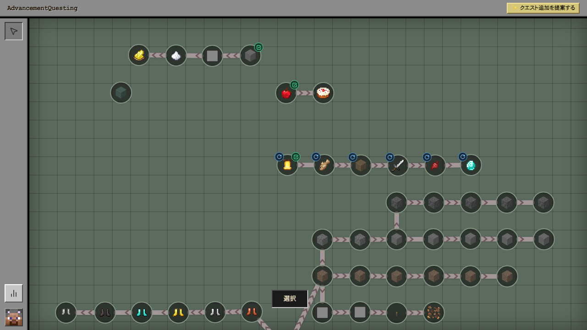
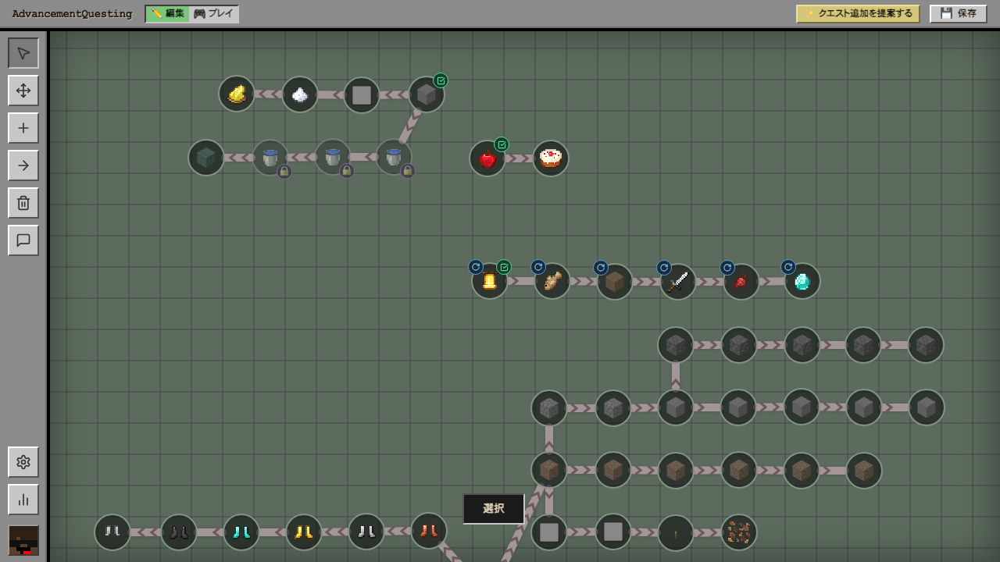
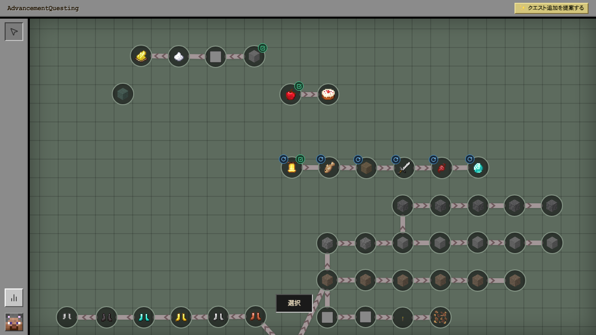
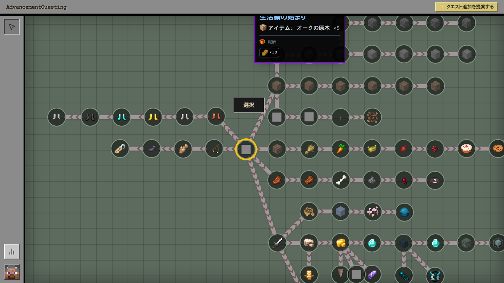
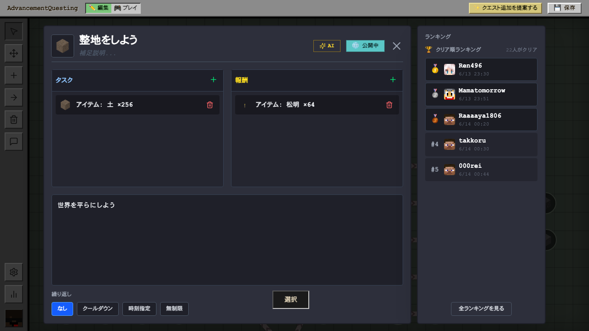
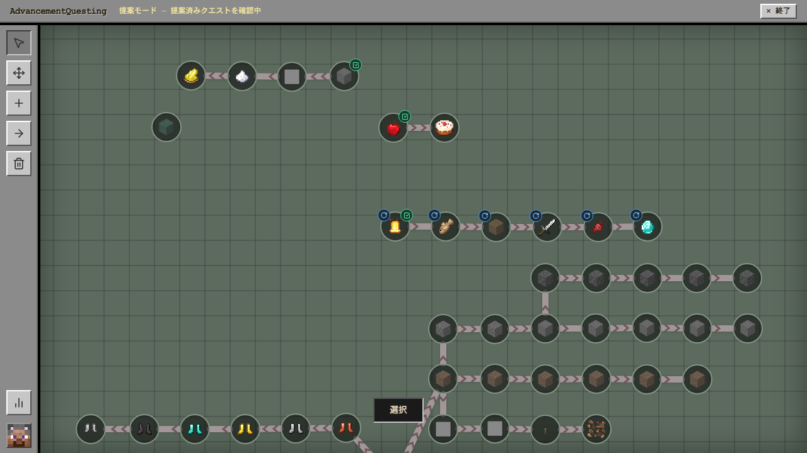
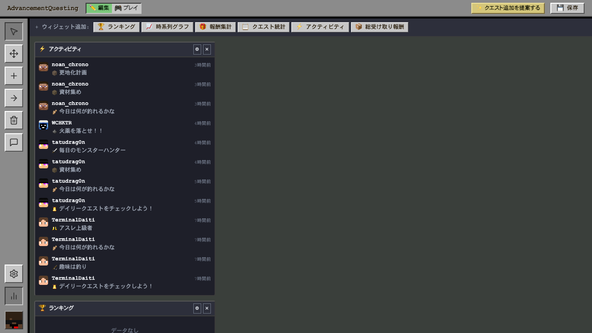

# AdvancementQuesting

**Minecraft のクエストを、チェスト GUI ではなく Web アプリで。**

Minecraft の進捗（Advancement）をベースにしたクエストシステム PaperMC プラグインです。  
サーバーに組み込まれた Web UI からブラウザでクエストの閲覧・管理・競い合いができます。

---

## なぜ AdvancementQuesting？

[Quests](https://www.spigotmc.org/resources/quests.3711/) のようなクエストプラグインはすでにありますが、**チェスト GUI での操作**が中心です。  
AdvancementQuesting は **ブラウザで動く Web アプリ** として実装しているため、広い画面・豊かな UI でクエストを楽しめます。

| | 従来のクエストプラグイン | AdvancementQuesting |
|---|---|---|
| UI | チェスト GUI（限られたスロット） | ブラウザ Web アプリ |
| クエスト作成 | コマンドや設定ファイル | ドラッグ＆ドロップのビジュアルエディター |
| ランキング | なし | クリア順・クリア回数ランキング |
| AI補助 | なし | ✨ AI がタイトル・説明文を提案 |
| モバイル | なし | スマートフォンにも対応 |

---

## 機能

### ビジュアルなクエストツリー

クエストをノードとして配置し、矢印でつないで依存関係を表現。進捗に応じてアイコンが変化します。

| プレイヤー視点 | エディター視点 |
|---|---|
|  |  |

エディターはサイドバーのツールでノードの追加・移動・削除・接続ができます。ドラッグ＆ドロップでレイアウトを自由に変更可能。

---

### クエスト詳細 ＋ クリアランキング

クエストをクリックすると、タスク（達成条件）・報酬・説明文と、**クリア順ランキング**がひとつの画面に表示されます。  
だれが一番早くクリアしたか一目でわかるため、サーバーメンバーとの競い合いが生まれます。

ノードにカーソルを合わせると報酬・条件のプレビューがポップアップ表示されます。

---

### ✨ AI アシスト ＆ 繰り返しクエスト

エディターのモーダル内に **✨ AI ボタン**があり、クリックするだけでクエストのタイトルと説明文の候補を 3 択で提案します。  
気に入った案をワンクリックで採用でき、コピーライティングの手間を大幅に削減できます。

また、クエストごとに **繰り返しタイプ**（クールダウン / 時刻指定 / 無制限）を設定でき、デイリークエストや無限周回クエストも作れます。

---

### プレイヤーによるクエスト提案

プレイヤーは「クエスト追加を提案する」ボタンからドラフトを作成・送信できます。  
管理者が承認するとクエストツリーに追加されるため、コミュニティ主導でクエストを増やせます。

---

### 統計ダッシュボード

アクティビティフィード・ランキング・時系列グラフ・報酬集計など複数のウィジェットをドラッグ＆ドロップで自由に配置できる管理ビューです。

---

### モバイル対応

スマートフォンのブラウザからもクエストツリーを閲覧・選択できます。

---

## セットアップ

[CONTRIBUTING.md](CONTRIBUTING.md) を参照してください。

## コマンド

| コマンド | 説明 |
|---|---|
| `/quest` | クエスト Web UI のアクセスコードを表示 |
| `/quest progress` | 自分の進捗サマリーを表示 |
| `/quest claim <id>` | 指定クエストの報酬を受け取る |
| `/quest_edit complete <player\|@a> <id>` | プレイヤーのクエストを完了状態にする（管理者用） |
| `/quest_edit uncomplete <player\|@a> <id>` | 完了状態を取り消す（管理者用） |

## 権限

| 権限ノード | デフォルト | 説明 |
|---|---|---|
| `aq.player` | 全員 | クエストの閲覧・プレイ |
| `aq.editor` | OP | クエストの編集・管理 |

## ライセンス

[MIT](LICENSE) © 2026 Kamesuta
